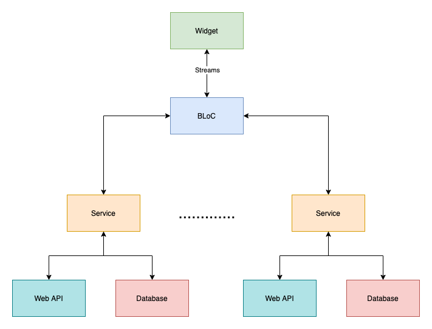

# Simply Weather

A flutter project built to help understand how flutter works for mobile application development and to help figure out design patterns.  

Currently the app is architected as follows:

## BLoC Pattern
This App is using the BLoC pattern to ensure that the widgets do not contain any business logic.  The BLoC pattern when coupled with [Streams](https://dart.dev/tutorials/language/streams) in flutter is a powerful tool when it comes to separating out business logic from widgets.

### Provider (future update)
This works out well for the most part, with the only exceptionbeing that the Location Service needs to be able to update the BLoC data when the location changes.  Currently I have implemented this via a stream that the BLoC subscribes too, this seems to create a bit of a mess that I believe could be solved with via the [Change Notifier](https://flutter.dev/docs/development/data-and-backend/state-mgmt/simple#changenotifier) available in flutter.  In a future update I will be converting the Location Service to be a provider in this pattern to avoid these weird cases.

## Getting Started

In order to run this application you will need to create a file with the following constants:  

const String OPEN_WEATHER_API_KEY = ""; 
const String MAPBOX_API_KEY = ""; 

These keys will need to be populated with keys created from the following sources (don't worry this is all free): 
[Open Weather](https://home.openweathermap.org/users/sign_in) 
[Map Box](https://account.mapbox.com/) 

These API's are used to get weather and map information show in the app.
